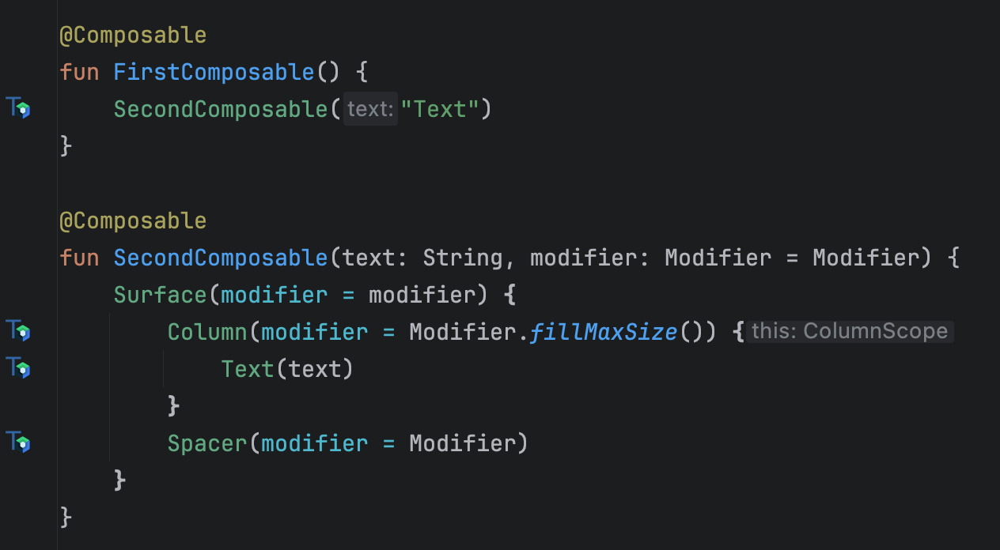

# vkcompose

[](https://central.sonatype.com/search?q=vkompose)

The repository contains utilities for Jetpack Compose, including Kotlin compiler plugins, IDEA plugin, and a Detekt rule.

### Kotlin Compiler Plugins

Compiler plugins support kotlin version from 1.8.10 to 1.9.21. Also you can try them for kotlin v2.0, but this version is not a stable release yet.

Currently, the following compiler plugins are available:
- Functions skippability checker: Determines [function skippability](https://github.com/androidx/androidx/blob/androidx-main/compose/compiler/design/compiler-metrics.md#functions-that-are-restartable-but-not-skippable) based on checking function parameters stability.
- Recomposed function highlighter: Highlights recomposed functions with a colored border which increases the width when the recompositions count becomes larger. See [here](https://android-developers.googleblog.com/2022/03/play-time-with-jetpack-compose.html)
- Recomposed function reasons logger: Logs reasons for recomposed functions when arguments of that function has been changed. It's like a [Rebugger](https://github.com/theapache64/rebugger), but automated. You don’t need to register the logger/rebugger in suspected problem areas every time
- Test tag generator for Composable functions: Adds generated test tag for composable function if there is a default Modifier that does not have a applied testTag.
- Test tag remover: Removes all test tags by replacing them with an empty string.
- Test tag drawer: Draws test tags in a dialog for long tap. (It`s very experimental. I am looking for a better solution)
- SourceInformation function calls remover: Yes, you can use sourceInformation option for Compose Compiler "-Pplugin:androidx.compose.compiler.plugins.kotlin:sourceInformation=false", but AGP enables that by default for debug builds.

How to use?
1. Apply Gradle plugin
```kotlin
plugins {
    id("com.vk.vkompose") version "0.3.1"
}
```

2. Enable and configure your desired features. For example:
```kotlin
vkompose {
    skippabilityCheck = true
    // or
    skippabilityCheck {
        // For more see
        // https://android-review.googlesource.com/c/platform/frameworks/support/+/2668595
        // https://issuetracker.google.com/issues/309765121
        stabilityConfigurationPath = "/path/file.config"
    }

    recompose {
        isHighlighterEnabled = true
        isLoggerEnabled = true
    }

    testTag {
        isApplierEnabled = true
        isDrawerEnabled = false
        isCleanerEnabled = false
    }

    sourceInformationClean = true
}
```
3. Enable some plugins in your application code
```kotlin
import com.vk.compose.test.tag.drawer.TestTagDrawConfig
import com.vk.recompose.highlighter.RecomposeHighlighterConfig
import com.vk.recompose.logger.RecomposeLoggerConfig

RecomposeLoggerConfig.isEnabled = true
RecomposeHighlighterConfig.isEnabled = true
TestTagDrawConfig.isEnabled = true
```

Besides these plugins are published separately. So if you want to use only one, you can do.
```kotlin
plugins {
    id("com.vk.recompose-highlighter") version "0.3.1"
    id("com.vk.recompose-logger") version "0.3.1"
    id("com.vk.compose-test-tag-applier") version "0.3.1"
    id("com.vk.compose-test-tag-cleaner") version "0.3.1"
    id("com.vk.compose-test-tag-drawer") version "0.3.1"
    id("com.vk.compose-source-information-cleaner") version "0.3.1"
    id("com.vk.composable-skippability-checker") version "0.3.1"
}

recomposeHighlighter {
    isEnabled = false // true by default
}

recomposeLogger {
    isEnabled = false // true by default
}

composeTestTagApplier {
    isEnabled = false // true by default
}

composeTestTagCleaner {
    isEnabled = false // true by default
}

composeTestTagDrawer {
    isEnabled = false // true by default
}

composeSourceInformationCleaner {
    isEnabled = false // true by default
}

composableSkippabilityChecker {
    isEnabled = false // true by default
    stabilityConfigurationPath = "/path/file.config"
}
```

Also if you enable recompose logger, you can add logger manually function that track changes of arguments. For example:
```kotlin
import com.vk.recompose.logger.RecomposeLogger

RecomposeLogger(
    name = "Some Function Name",
    arguments = mapOf("param1" to param1, "param2" to param2),
)
```
And check logs with tag "RecomposeLogger". This already looks like the [Rebugger](https://github.com/theapache64/rebugger) is working.

### IDEA Plugin
The IDEA plugin currently offers two features:
- Error for unskippable functions and unstable parameters


- Marker for generated test tag values
!

Both features can be disabled in preferences:

You can download and install it from the jar file for [Hedgehog](idea-plugin/vkompose-idea-plugin/vkompose-idea-plugin-0.1-Hedgehog.jar) or [Iguana](idea-plugin/vkompose-idea-plugin/vkompose-idea-plugin-0.1-Iguana.jar) versions of AS.

### [Detekt](https://github.com/detekt/detekt) Rule
There is one rule available that checks the skippability of functions. To use it, apply the dependency via the detektPlugin configuration in the dependencies block.
```kotlin
dependencies {
    detektPlugins("com.vk.vkompose:0.3.1")
}
```

Also you can disable checking some classes in detekt config file
```yaml
vkompose:
  NonSkippableComposable:
    active: true
    ignoredClasses: [ 'kotlin.*', 'my.clazz.Data' ]
```

### Known issues
- Idea plugin does not allow to disable checking stability of some classes
- Idea plugin cannot draw a test tag marker for functions from other libraries if they have a default Modifier value and Modifier is not explicitly passes as an argument. For more see [KTIJ-27688](https://youtrack.jetbrains.com/issue/KTIJ-27688/Quick-documentation-shows-COMPILEDCODE-instead-of-the-real-default-value-for-compiled-code-with-sources)