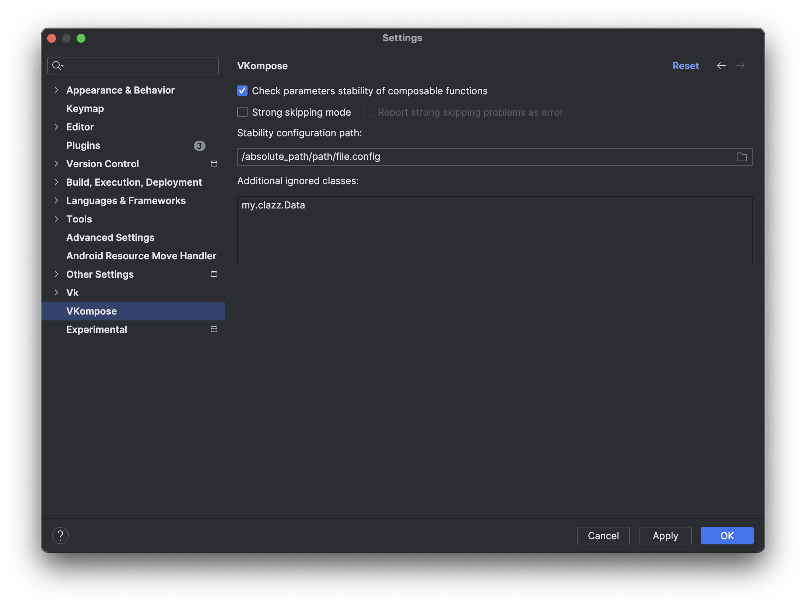

# vkcompose

[](https://central.sonatype.com/search?q=vkompose)

The repository contains utilities for Jetpack Compose, including Kotlin compiler plugins, IDEA plugin, and a Detekt rule.

### Kotlin Compiler Plugins

| Plugin Version | Kotlin version  |
|----------------|-----------------|
| 0.6.2          | 1.8.10 - 1.9.23 |
| 0.6-k2         | 2.0             |
| 0.6.2-k2       | 2.0.20          |
| 0.7            | 2.1.0           |
| 0.7.1          | 2.2.0           |

Currently, the following compiler plugins are available:
- Functions skippability checker: Determines [function skippability](https://github.com/androidx/androidx/blob/androidx-main/compose/compiler/design/compiler-metrics.md#functions-that-are-restartable-but-not-skippable) based on checking function parameters stability.
- Recomposed function highlighter: Highlights recomposed functions with a colored border which increases the width when the recompositions count becomes larger. See [here](https://android-developers.googleblog.com/2022/03/play-time-with-jetpack-compose.html)
- Recomposed function reasons logger: Logs reasons for recomposed functions when arguments of that function has been changed. It's like a [Rebugger](https://github.com/theapache64/rebugger), but automated. You don’t need to register the logger/rebugger in suspected problem areas every time
- Test tag generator for Composable functions: Adds generated test tag for composable function if there is a default Modifier that does not have an applied testTag.
- Test tag remover: Removes all test tags by replacing them with an empty string.
- Test tag drawer: Draws test tags in a dialog for long tap. (It`s very experimental. I am looking for a better solution)
- SourceInformation function calls remover: Yes, you can use sourceInformation option for Compose Compiler "-Pplugin:androidx.compose.compiler.plugins.kotlin:sourceInformation=false", but AGP enables that by default for debug builds. For AGP 8.4.0 see use Compose Compiler option. You can see fix [here](https://issuetracker.google.com/issues/318384658)

How to use?
1. Apply Gradle plugin
```kotlin
plugins {
    id("com.vk.vkompose") version "0.7.1"
}
```

2. Enable and configure your desired features. For example:
```kotlin
vkompose {
  skippabilityCheck = true
  // or
  skippabilityCheck {
    // For more see
    // https://android-review.googlesource.com/c/platform/frameworks/support/+/2668595
    // https://issuetracker.google.com/issues/309765121
    stabilityConfigurationPath = "/path/file.config"

    // since 0.7.1 if strong skipping feature of Compose Compiler is enabled
    strongSkippingEnabled = true
    // or
    strongSkipping {
      // Fail compilation if there is any problem with strong skipping mode
      strongSkippingFailFastEnabled = false // false by default
    }
  }

  recompose {
    isHighlighterEnabled = true
    isLoggerEnabled = true
    // or
    logger {
      // true by default since 0.5
      // log modifier arguments changes
      logModifierChanges = true
      // true by default since 0.5
      // log when function arguments (like lambdas or function references) of composable function are changed
      logFunctionChanges = true
    }
  }

  testTag {
    isApplierEnabled = true
    isDrawerEnabled = false
    isCleanerEnabled = false

    isApplierEnabled = true
    // or
    tagApplier {
      tagTemplate = "" // how to generate test tag. by default "%filename%-%parent_function_name%(%parent_function_offset%)-%calling_function_name%(%calling_function_offset%)"
    }
  }

  sourceInformationClean = true
}
```
3. Enable some plugins in your application code
```kotlin
import com.vk.compose.test.tag.drawer.TestTagDrawConfig
import com.vk.recompose.highlighter.RecomposeHighlighterConfig
import com.vk.recompose.logger.RecomposeLoggerConfig

RecomposeLoggerConfig.isEnabled = true
RecomposeHighlighterConfig.isEnabled = true
TestTagDrawConfig.isEnabled = true
```

Besides these plugins are published separately. So if you want to use only one, you can do.
```kotlin
plugins {
    id("com.vk.recompose-highlighter") version "0.7.1"
    id("com.vk.recompose-logger") version "0.7.1"
    id("com.vk.compose-test-tag-applier") version "0.7.1"
    id("com.vk.compose-test-tag-cleaner") version "0.7.1"
    id("com.vk.compose-test-tag-drawer") version "0.7.1"
    id("com.vk.compose-source-information-cleaner") version "0.7.1"
    id("com.vk.composable-skippability-checker") version "0.7.1"
}

recomposeHighlighter {
    isEnabled = false // true by default
}

recomposeLogger {
    isEnabled = false // true by default
    logModifierChanges = true // true by default since 0.5
    logFunctionChanges = true // true by default since 0.5
}

composeTestTagCleaner {
    isEnabled = false // true by default
}

composeTestTagDrawer {
    isEnabled = false // true by default
}

composeSourceInformationCleaner {
    isEnabled = false // true by default
}

composableSkippabilityChecker {
    isEnabled = false // true by default
    stabilityConfigurationPath = "/path/file.config"
}

composeTestTagApplier {
  isEnabled = false // true by default
  tagTemplate = "" // how to generate test tag. by default "%filename%-%parent_function_name%(%parent_function_offset%)-%calling_function_name%(%calling_function_offset%)"
}
```

Use these placeholders to generate tag:
- %filename%
- %parent_function_name%
- %parent_function_offset%
- %calling_function_name%
- %calling_function_offset%
- %outer_function_name\[range=:]\[delimiter="value"]\[prefix="value"]\[suffix="value"]% - all groups are optional

'range' in %outer_function_name% can be set as:
- range=: or range=1: - include all outer functions. default value
- range=2: - skip first function
- range=-1: - last function
- range=1:2 - first and second functions

If you enable recompose logger, you can add logger manually function that track changes of arguments. For example:
```kotlin
import com.vk.recompose.logger.RecomposeLogger

RecomposeLogger(
    name = "Some Function Name",
    arguments = mapOf("param1" to param1, "param2" to param2),
)
```
And check logs with tag "RecomposeLogger". This already looks like the [Rebugger](https://github.com/theapache64/rebugger) is working.

### IDEA Plugin
The IDEA plugin currently offers two features:
- Skippability checks
  - Show a error for a unskippable function with unstable parameters
  - Show a warning or error for a function in which parameters are compared by reference (if strong skipping is enabled)
    

- Marker for generated test tag values
  

Both features can be disabled in preferences:


You can download and install it from the jar file for [Narwhal](idea-plugin/vkompose/vkompose-0.4.2-Narwhal.jar) version of AS.

### [Detekt](https://github.com/detekt/detekt) Rule

Current version is `0.6`.

There is one rule available that checks the skippability of functions or stability of parameters. To use it, apply the dependency via the detektPlugin configuration in the dependencies block.
```kotlin
dependencies {
    detektPlugins("com.vk.vkompose:detekt:0.6")
}
```

Also you can disable checking some classes in detekt config file
```yaml
vkompose:
  NonSkippableComposable:
    active: true
    ignoredClasses: [ 'kotlin.*', 'my.clazz.Data' ]

# since 0.6
# It's usually the same thing as NonSkippableComposable, but the name is more correct for strong skip mode
  ParamsComparedByRef:
    active: true
    ignoredClasses: [ 'kotlin.*', 'my.clazz.Data' ]
```

### Notes
#### Strong skipping problems suppression since 0.6
In the compiler plugin, detector rules and plugin functions, ideas can be suppressed by either of the suppressions: NonSkippableComposable or ParamsComparedByRef.
The NonSkippableComposable suppression will be removed in the future. For now, if strong skip is enabled, the idea plugin will mark NonSkippableComposable as unused and you can easily switch to ParamsComparedByRef

### Known issues
- Idea plugin cannot draw a test tag marker for functions from other libraries if they have a default Modifier value and Modifier is not explicitly passes as an argument. For more see [KTIJ-27688](https://youtrack.jetbrains.com/issue/KTIJ-27688/Quick-documentation-shows-COMPILEDCODE-instead-of-the-real-default-value-for-compiled-code-with-sources)
